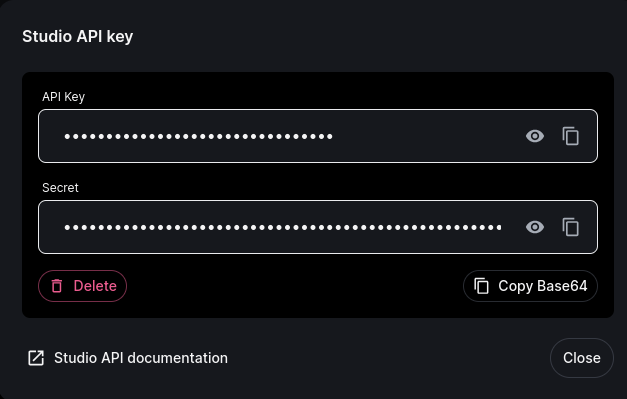

# GoLang InWorld.ai API Wrapper


This project provides a GoLang based API wrapper to interact with the [InWorld.ai API](https://docs.inworld.ai/).
It allows users to conveniently call InWorld.ai functions and use its features without having to deal with underlying
REST API calls.

## Features

1. **Error Types** - A specific error response format in case of any API errors.
2. **Client** - An easy to use Client for InWorld.ai with simple and studio API keys.
3. **Stable API Requests** - Reliable and robust sending of API requests.

## Installation

```shell
go get github.com/psyhatter/inworld@latest
```

## Usage

1. Create a new workspace [here](https://studio.inworld.ai/workspaces).
2. Generate API keys:
    - For Simple API key, go to the integrations tab, generate a new key, and copy it by clicking on the "Copy Base64" button.
      
    - For Studio API key, click on the profile icon in the upper right corner, select "Studio API key" and click the "Copy Base64" button.
      
      
3. Import the package:
```go
import "github.com/psyhatter/inworld"
```
4. Instantiate a new client using API keys:
```go
client := inworld.NewClient(simpleAPIKey, studioAPIKey, http.Client{})
```
5. Use the client to call InWorld.ai API.

### Examples:
```go
// Get a specific character
char, err := client.GetCharacter(context.Background(), characterName, inworld.CharacterItemViewWithMeta)

// Create a new scene
scene, err := client.CreateScene(context.Background(), workspaceID, newScene)

// Send a text request to single character
interaction, err := client.SimpleSendText(
    context.Background(),
    inworld.SimpleSendTextRequest{
        Character: "Character-Name",
        Text:      "Hello, InWorld!",
    },
)
```

## Documentation

For full documentation of InWorld.ai API please visit [InWorld.ai API documentation](https://docs.inworld.ai/)

## Contributions

Contributions, issues and feature requests are welcome!

## License

This project is licensed under the MIT License. See the LICENSE file for details.

## Disclaimer

This software is provided on an "As-Is" basis, without any warranties or conditions of any kind, either expressed,
implied or statutory including, without limitation, any warranty or condition of performance, merchantability, fitness
for a particular purpose, durability, title and non-infringement.